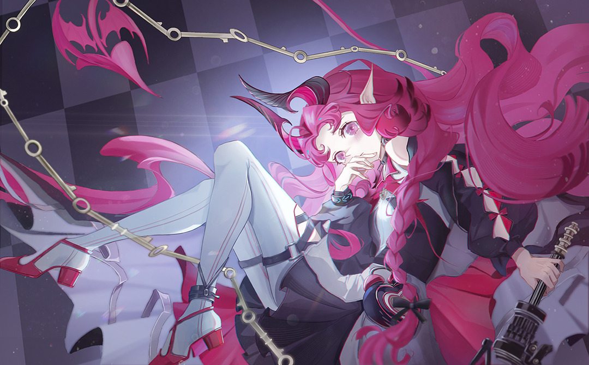

# Code

```java
import sun.misc.Unsafe;

import java.lang.invoke.MethodHandles.Lookup;
import java.lang.reflect.Field;

public class Main {
	public static final Unsafe unsafe = getUnsafe();
	public static final Lookup lookup = getLookup();

	public static void main(String[] args) {
		System.out.println("oh no");
	}

	private static Unsafe getUnsafe() {
		try {
			Field field = Unsafe.class.getDeclaredField("theUnsafe");
			field.setAccessible(true);
			return (Unsafe) field.get(null);
		} catch (Exception e) {
			throw new RuntimeException(e);
		}
	}

	private static Lookup getLookup() {
		try {
			return (Lookup) unsafe.getObject(Lookup.class, unsafe.staticFieldOffset(Lookup.class.getDeclaredField("IMPL_LOOKUP")));
		} catch (Exception e) {
			throw new RuntimeException(e);
		}
    }
}
```



# Github Stats


